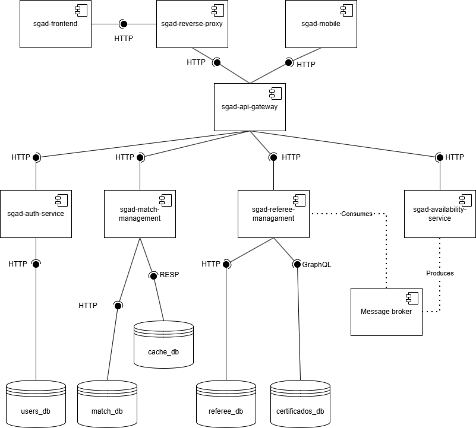
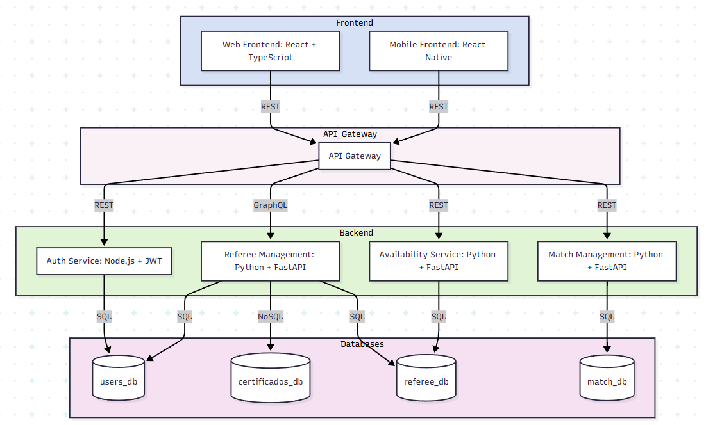

# SGAD – Sistema de Gestión de Árbitros y Designaciones
<div align="center">
  
</div>

---

## 👥 Equipo

Grupo **Arquisoft G1C**  
- Wullfredo Javier Barco Godoy – wbarco@unal.edu.co  
- Jacel Thomás Enciso Pinzón – jencisop@unal.edu.co  
- Santiago Nova Acosta – snova@unal.edu.co 
- Nombre 4 – correo@unal.edu.co  

---

## 📖 Descripción

El **SGAD (Sistema de Gestión de Árbitros y Designaciones)** es una plataforma web distribuida que facilita la **asignación imparcial de árbitros a partidos deportivos**, la **gestión administrativa** de árbitros y partidos, y el **control de disponibilidad y pagos**.  

Este proyecto corresponde al **Prototype 1** de la materia **Software Architecture (2025-II)**.

---

## 🎯 Objetivo del Prototipo

Construir un **prototipo vertical** basado en un diseño arquitectónico inicial que permita:  
- Validar el estilo arquitectónico escogido (**microservicios distribuidos con API Gateway**).  
- Demostrar el uso de **distintos lenguajes de programación**.  
- Integrar **bases de datos relacional y NoSQL**.  
- Probar el **despliegue en contenedores (Docker)**.  

---

## 📌 Requerimientos

### Funcionales
- Registro y consulta de árbitros.  
- Gestión de partidos.  
- Asignación de árbitros a partidos.  
- Autenticación básica de usuarios.  

### No Funcionales
- Arquitectura distribuida con microservicios.  
- 1 componente de presentación (frontend web).  
- 2 o más componentes de lógica (gestión de árbitros y partidos).  
- 2 componentes de datos (SQL y NoSQL).  
- 2 tipos de conectores HTTP (REST y GraphQL).  
- 2 lenguajes de programación (Python, JavaScript y TypeScript).  
- Despliegue contenerizado (Docker).  

---

## 🏗️ Estructuras Arquitectónicas

### 🔹 Diagrama de Componentes y Conectores

  

Este diagrama muestra la arquitectura del SGAD organizada en componentes y conectores:

**1. Web Frontend: React + TypeScript**
- **Tipo:** Capa de presentación  
- **Responsabilidad:** Interfaz web del sistema SGAD, desde donde los usuarios acceden a las funcionalidades de gestión de árbitros, partidos y autenticación.  
- **Tecnologías:** React (para UI dinámica) y TypeScript (para tipado y mantenimiento).  
- **Conexiones:**  
  - Envía solicitudes **REST** al *Auth Service* y *Match Management*.  
  - Envía solicitudes **GraphQL** al *Referee Management*.  

**2. Auth Service: Node.js + JWT**
- **Tipo:** Servicio backend  
- **Responsabilidad:** Gestionar autenticación y autorización de usuarios.  
- **Tecnologías:** Node.js con Express y JWT (JSON Web Token).  
- **Funciones principales:**
  - Validación de credenciales.  
  - Generación y verificación de tokens JWT.  
  - Almacenamiento de usuarios en PostgreSQL.  
- **Conexiones:**
  - Recibe peticiones **REST** desde el frontend.  
  - Se comunica mediante **SQL** con SGAD_DB.

**3. Match Management: Python + FastAPI**
- **Tipo:** Servicio backend  
- **Responsabilidad:** Gestionar información de partidos (creación, programación, resultados, etc.).  
- **Tecnologías:** Python + FastAPI.  
- **Funciones principales:**
  - API REST para gestión CRUD de partidos.  
  - Integración con PostgreSQL para persistencia de datos.  
- **Conexiones:**
  - Recibe solicitudes **REST** del frontend.  
  - Se comunica con SGAD_DB usando **SQL**.  

**4. Referee Management: Python + FastAPI + GraphQL**
- **Tipo:** Servicio backend especializado  
- **Responsabilidad:** Administración de árbitros, historial, evaluaciones y certificados.  
- **Tecnologías:** Python, FastAPI.  
- **Funciones principales:**
  - Guardar datos estructurados de árbitros en PostgreSQL.  
  - Almacenar certificados y documentos en MongoDB.  
- **Conexiones:**
  - Recibe solicitudes **GraphQL** del frontend.  
  - Se comunica con SGAD_DB (SQL) y Certificados_DB (NoSQL).
  
**5. SGAD_DB**
- **Tipo:** Base de datos relacional  
- **Responsabilidad:** Almacenar la información estructurada del sistema (usuarios, árbitros, partidos).  
- **Tecnologías:** PostgreSQL 14+.  
- **Conexiones:**  
  - Auth Service (usuarios)  
  - Match Management (partidos)  
  - Referee Management (árbitros)
 
**6. Certificados_DB**
- **Tipo:** Base de datos NoSQL  
- **Responsabilidad:** Almacenamiento de certificados y documentos asociados a los árbitros.  
- **Tecnologías:** MongoDB 6+.  
- **Conexiones:**  
  - Exclusivamente con el servicio *Referee Management*.  

**Conectores**

| **Conector** | **Tipo / Protocolo** | **Dirección** | **Descripción funcional** |
|---------------|----------------------|----------------|----------------------------|
| Frontend → Auth Service | REST (HTTP) | Bidireccional (solicitud/respuesta) | Manejo de login, logout y validación de usuarios. |
| Frontend → Match Management | REST (HTTP) | Bidireccional | Envío y consulta de información sobre partidos. |
| Frontend → Referee Management | GraphQL (HTTP) | Bidireccional | Consultas estructuradas y flexibles sobre árbitros y sus datos. |
| Auth Service → SGAD_DB | SQL | Unidireccional | Operaciones de lectura/escritura sobre usuarios y credenciales. |
| Match Management → SGAD_DB | SQL | Bidireccional | Persistencia de partidos y resultados. |
| Referee Management → SGAD_DB | SQL | Bidireccional | Persistencia de datos básicos de árbitros. |
| Referee Management → Certificados_DB | NoSQL | Bidireccional | Almacenamiento de certificados y documentos. |

---

### 🔹 Vista General de la Arquitectura

La vista general muestra el sistema completo en una capa macro. Los **actores externos** (Árbitro, Club/Equipo, Administrador) interactúan con el sistema a través del **Frontend**. Este se comunica con un **API Gateway** que centraliza el acceso y enruta las peticiones hacia los microservicios internos. Los microservicios (`match-management`, `referee-management`, `auth-service`) a su vez dependen de la infraestructura de datos, conformada por una **base relacional (PostgreSQL)** y una **base NoSQL (MongoDB/Redis)**. Esta vista resume las dependencias y puntos de integración del sistema.

  
Esta vista muestra todo el ecosistema del sistema **SGAD** en un solo diagrama:  
- **Actores externos**: Árbitro, Club/Equipo y Administrador.  
- **Frontend** como punto de acceso al sistema.  
- **API Gateway** como conector central de los microservicios.  
- **Microservicios**: gestión de partidos, gestión de árbitros y autenticación.  
- **Infraestructura**: bases de datos relacional (SQL) y NoSQL.  

---

### 🔹 Vista de Contexto

La vista de contexto representa al sistema **SGAD como una caja negra** en interacción con su entorno. El **Árbitro** consulta sus designaciones, el **Club/Equipo** solicita árbitros, y el **Administrador** gestiona partidos y recibe reportes. Cada actor utiliza la interfaz del sistema (frontend), sin necesidad de conocer los detalles de implementación. Esta vista evidencia el alcance del sistema y sus límites con respecto a usuarios externos.


.JPG)  
El sistema se ve como una **caja negra** y se representan las interacciones externas:  
- El **Árbitro** consulta designaciones.  
- El **Club/Equipo** solicita árbitros.  
- El **Administrador** gestiona partidos y recibe reportes y notificaciones.  

---

### 🔹 Vista de Despliegue
La vista de despliegue muestra cómo los **contenedores Docker** alojan cada servicio. El **Frontend**, el **API Gateway**, `match-management`, `referee-management`, y `auth-service` se ejecutan como contenedores independientes. Además, las bases de datos (**PostgreSQL** y **MongoDB**) corren en contenedores separados, facilitando la orquestación mediante `docker-compose`. Las relaciones entre nodos se establecen como enlaces de red internos de Docker, lo cual asegura la comunicación entre servicios sin exponer puertos innecesarios al exterior.


.png)  
Describe cómo se despliegan los componentes en contenedores Docker:  
- Cada microservicio corre en su propio contenedor.  
- El **API Gateway** intermedia entre frontend y servicios.  
- **PostgreSQL** almacena información de partidos y autenticación.  
- **MongoDB** almacena la disponibilidad de árbitros y datos no estructurados.  

---

### 🔹 Vista de Capas
Su objetivo es mostrar cómo se divide la aplicación en niveles funcionales y qué capa puede comunicarse con cuál, promoviendo la separación de responsabilidades y la mantenibilidad.

  

**Estructura**

- **Capa de Presentación**:
Interactúa con el usuario final. Gestiona la interfaz y la comunicación con la capa lógica.
  - SGAD-Frontend: React + TypeScript.

- **Capa Lógica o de Negocio**:
Contiene la lógica central del sistema, las reglas de negocio y la coordinación entre módulos.
  - Auth Service: (Node.js)
  - Match Management: (FastAPI)
  - Referee Management: (FastAPI)

- **Capa de Datos**:
Administra la persistencia y el acceso a la información.
  - SGAD-DB: PostgreSQL
  - Certificados-DB: MongoDB

---

### 🔹 Vista de Descomposición
La vista de descomposición muestra cómo el sistema SGAD se divide en módulos y submódulos funcionales, representando la estructura jerárquica del sistema.

  

**Estructura**

- **Frontend**:  Provee la interfaz de usuario
  - **Web Page**: Provee la interfaz de usuario para la gestión de árbitros, partidos y autenticación.

- **Backend**:  Implementar la lógica de negocio del sistema.
  - **Auth Service**: Gestiona registro, login y control de acceso.
  - **Match Management**: Gestiona los partidos y asignaciones.
  - **Referee Management**: Administra árbitros y certificados.

- **Capa de Datos**:  Garantizar la persistencia y consistencia de los datos.
  - **SGAD-DB**: Almacena información relacional (usuarios, partidos, árbitros).
  - **Certificados-DB**: Almacena documentos y certificaciones de árbitros.

---

### 🔹 Caso de Uso – Asignación de Árbitro

El caso de uso describe el flujo dinámico de asignación de árbitros. El **Administrador** solicita la designación de un árbitro desde el **Frontend**, que envía la petición al **API Gateway**. Este valida el partido con el **Match Service** y solicita al **Referee Service** la disponibilidad de árbitros. El **Referee Service** consulta su base de datos NoSQL y responde con árbitros disponibles. El Match Service selecciona uno y devuelve la confirmación, que viaja de regreso al administrador. Esta vista ilustra las **interacciones paso a paso** y cómo los microservicios colaboran para resolver un requerimiento funcional clave.


.JPG)  
Representa un escenario dinámico: la **asignación de un árbitro a un partido**.  
1. El **Administrador** solicita la designación.  
2. El **Frontend** envía la solicitud al **API Gateway**.  
3. El **Match Service** valida el partido.  
4. El **Referee Service** consulta la disponibilidad en la BD.  
5. Se selecciona un árbitro disponible y se confirma al administrador.

---

## ✅ Validación del Prototipo Vertical

El **Prototype 1** del SGAD implementa un flujo **extremo a extremo (end-to-end)** que permite validar las decisiones arquitectónicas tomadas.  
El flujo seleccionado corresponde al caso de uso central del sistema: **asignación de árbitro a partido**.

### Flujo vertical implementado

1. **Administrador**  
   - Ingresa al sistema a través del **Frontend** y solicita la asignación de un árbitro a un partido específico.

2. **Frontend → API Gateway**  
   - El frontend envía la solicitud al **API Gateway**, que actúa como punto de entrada único.  
   - El gateway valida la autenticación (JWT) mediante el **Auth Service** y enruta la petición hacia el microservicio correspondiente.

3. **API Gateway → Match Service**  
   - El **Match Management Service** recibe la solicitud, valida que el partido exista en la **base de datos relacional (PostgreSQL)** y verifica que pueda asignarse un árbitro.

4. **Match Service → Referee Service**  
   - Para asignar un árbitro, el servicio de partidos consulta al **Referee Management Service**, que mantiene la información de árbitros en una **base de datos relacional (PostgreSQL)**.  
   - Se obtiene la lista de árbitros disponibles.

5. **Selección y confirmación**  
   - El **Match Service** selecciona un árbitro disponible y registra la designación en PostgreSQL.  
   - La respuesta se devuelve al **Frontend** a través del **API Gateway**.

6. **Administrador visualiza resultado**  
   - El frontend muestra al administrador qué árbitro fue asignado exitosamente.

---

### 🔎 Aspectos validados con este flujo

- **Estilo arquitectónico**: uso de microservicios distribuidos coordinados por un API Gateway.  
- **Heterogeneidad tecnológica**: integración de Node.js (gateway/auth/frontend) y Python (match/referee).  
- **Persistencia policroma**: PostgreSQL para datos relacionales (partidos) y MongoDB para datos no estructurados (certificación de árbitro).  
- **Despliegue contenerizado**: cada servicio corre en su contenedor Docker, orquestados con `docker-compose`.  
- **Comunicación REST**: interacción entre servicios usando HTTP/JSON, incluyendo validación con JWT.  

---


## ⚙️ Decisiones Arquitectónicas


### 1. Estilo arquitectónico
Se eligió un estilo de **microservicios distribuidos** con un **API Gateway** al frente.  
Esto permite:  
- Independencia de despliegue y escalabilidad por servicio.  
- Uso de distintos lenguajes y tecnologías según convenga.  
- Aislamiento de fallos y mayor resiliencia.  

### 2. Lenguajes y frameworks
Se emplean **dos lenguajes de programación principales** (requisito de la entrega):  

- **JavaScript/TypeScript**  
  - **Frontend**: construido con **React** para ofrecer una interfaz rápida, modular y con soporte moderno de ESModules.  
  - **API Gateway y Auth Service**: implementados con **Node.js + Express**, lo que facilita el enrutamiento, la integración de middleware y la validación de JWT.  

- **Python**  
  - **Match Management Service**: desarrollado con **FastAPI**, ideal por su soporte a documentación automática con Swagger, alto rendimiento (ASGI) y tipado con Pydantic.  
  - **Referee Management Service**: también con **FastAPI**, aprovechando la misma pila para simplificar mantenimiento y consistencia en servicios de lógica de negocio.  

### 3. Bases de datos
- **PostgreSQL** → usado por `match-management` y `auth-service` para datos relacionales (partidos, usuarios, asignaciones).  
- **MongoDB** → usado por `referee-management` para datos dinámicos como certificación de árbitros.  
- **Redis** (opcional en Prototype 1, pero previsto) → soporte para cacheo de tokens, sesiones y colas de notificaciones.  

### 4. Conectores
La comunicación se realiza vía **REST sobre HTTP/JSON**.  
- El **API Gateway** es el único punto expuesto al frontend y aplica seguridad (JWT), rate limiting y logging.  
- Los microservicios exponen endpoints REST internos (`/matches`, `/referees`, `/auth`).  

### 5. Despliegue
- **Docker** se usa para encapsular cada servicio y base de datos en contenedores independientes.  
- **Docker Compose** coordina la infraestructura completa, facilitando el levantamiento del entorno en una sola instrucción.  
- Esta decisión asegura que el sistema se pueda desplegar en cualquier entorno con mínima configuración.  

---

---
## 🎨 Estilos arquitectónicos (SGAD)

SGAD adopta un **estilo de microservicios** con **API Gateway** al frente. Cada capacidad de negocio (partidos, árbitros, autenticación) vive en su propio servicio, se despliega de forma independiente (Docker) y se comunica mediante **REST/HTTP** usando **JSON**.

### ¿Por qué microservicios y no monolito?

**Monolito (descartado para SGAD)**
- Pros: simplicidad inicial, una sola base de código, despliegue único.
- Contras: acoplamiento alto, una falla puede tumbar todo, escalar una parte obliga a escalar todo, barreras para usar múltiples lenguajes o motores de datos.

**Microservicios (elegido)**
- Se alinean con los **módulos de negocio** del dominio (partidos, árbitros, auth).
- Permiten **tecnologías heterogéneas** (p. ej., Python para lógica de negocio; Node.js en gateway/frontend).
- Habilitan **bases de datos policromas**: **PostgreSQL** para datos relacionales y **MongoDB** para disponibilidad/registros no estructurados.
- Soportan **despliegue/escala independiente** por demanda (p. ej., escalar Referee o Match sin tocar los demás).
- Encajan con la necesidad de **entregas incrementales** del curso (Prototype 1, 2, …).

### Ventajas principales

- **Escalabilidad independiente**: cada servicio escala según su carga.
- **Aislamiento de fallas**: una caída en un servicio no detiene a los demás.
- **Evolución tecnológica**: cambiar framework/BD en un servicio no afecta al resto.
- **Ciclos de despliegue más cortos**: se actualiza solo el servicio modificado.
- **Seguridad y gobierno centralizados** a través del **API Gateway** (autenticación, rate-limiting, logging).

### Trade-offs / Costes

- **Complejidad operacional**: más servicios → más orquestación/observabilidad.
- **Latencia de red**: llamadas entre servicios agregan hops.
- **Consistencia de datos**: se prefiere **consistencia eventual** entre servicios/BDs.
- **Pruebas de integración**: requieren entornos con varios contenedores (Compose).
- **Gestión de configuración**: variables de entorno por servicio (URLs, credenciales).

> Cómo mitigamos: Docker Compose para orquestación local, **API Gateway** para cross-cutting concerns, endpoints de health (`/health`) y convenciones de contratos REST.

### Comunicación (REST sobre HTTP)

- **Patrón**: **Frontend ⇆ API Gateway ⇆ Microservicios**.  
  El gateway enruta, autentica (JWT), aplica rate-limit y uniformiza respuestas/errores.
- **Formato**: `application/json` en request/response.
- **Verbos y rutas (ejemplos)**  
  - **Match Service**:  
    - `GET /matches`, `GET /matches/{id}`, `POST /matches`, `PUT /matches/{id}`, `DELETE /matches/{id}`
  - **Referee Service**:  
    - `GET /referees`, `GET /referees/{id}`, `POST /referees`, `PUT /referees/{id}`, `GET /referees/available`
  - **Auth Service**:  
    - `POST /auth/login`, `GET /auth/verify`, `GET /auth/profile`
- **Autenticación**: JWT en `Authorization: Bearer <token>`; el **gateway** valida y reenvía claims a los servicios.
- **Estados HTTP**: `200/201` ok, `400` solicitud inválida, `401/403` autenticación/autorización, `404` no encontrado, `409` conflicto, `500` error interno.
- **Salud/monitoring**:  
  - Gateway: `GET /health`, `GET /health/services`  
  - Servicios: `GET /health` (indica disponibilidad y conexión a su BD)
- **Descubrimiento/ruteo**: en local, nombres de servicio/puertos definidos en `docker-compose.yml` (p. ej., `match-service:8000`, `referee-service:8000`, `auth-service:3001`).

> Nota: Para notificaciones/colas futuras se considera **Redis** (cache/mensajería), manteniendo REST como canal principal para Prototype 1.

## 📂 Estructura del Repositorio

```
sgad-main/
│── README.md              # Documento principal
│── docker-compose.yml     # Orquestación de microservicios
│── .env.example           # Variables de entorno de ejemplo
│
├── docs/                  # Diagramas y documentación
│   ├── logo.png
│   ├── vista_general.jpg
│   ├── contexto.jpg
│   ├── cc.jpg
│   ├── deployment.jpg
│   └── caso_uso.jpg
│
└── scripts/               # Scripts de ayuda (opcional)
    ├── start.sh
    └── stop.sh
```

---

## 🚀 Despliegue Local

### 1. Clonar este repositorio
```bash
git clone https://github.com/Arquisoft-G1C/sgad-main.git
cd sgad-main
```

### 2. Configurar variables de entorno
Copiar `.env.example` a `.env` y ajustar credenciales (puertos, BDs, etc.).

### 3. Levantar el sistema
```bash
docker-compose up --build
```

### 4. Acceder al sistema
- **Frontend**: [http://localhost:3000](http://localhost:3000)  
- **Auth Service**: [http://localhost:8000](http://localhost:8000)
- **Match Service**: [http://localhost:8000](http://localhost:8001)
- **Referee Service**: [http://localhost:8000](http://localhost:8002)
- **Postgres**: "5432:5432"
- **Mongo**: "27017:27017"

---

## 🔗 Microservicios relacionados

- [sgad-frontend](../sgad-frontend)  
- [sgad-api-gateway](../sgad-api-gateway)  
- [sgad-match-management](../sgad-match-management)  
- [sgad-referee-management](../sgad-referee-management)  
- [sgad-auth-service](../sgad-auth-service)  
- [sgad-infrastructure](../sgad-infrastructure)  
